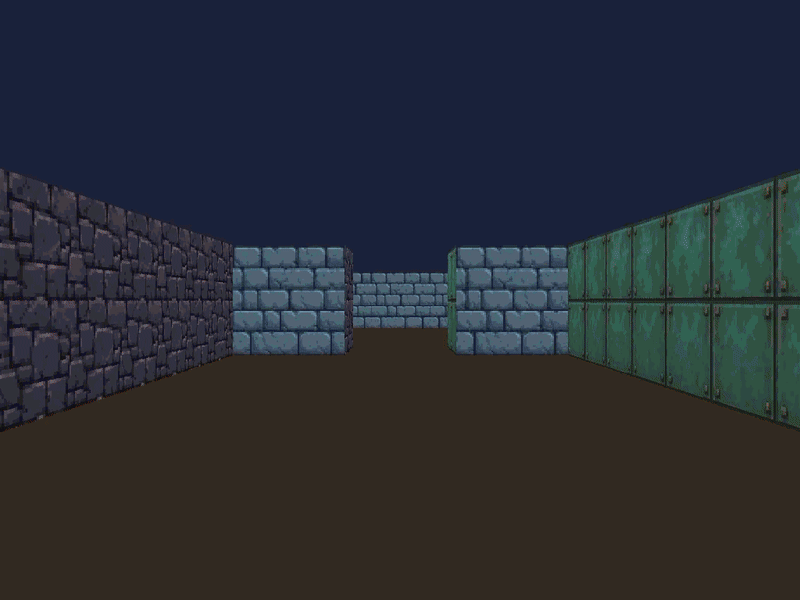
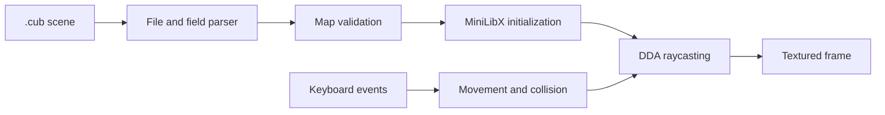

# Cub3D

[](https://github.com/C1STA/cub3d/actions/workflows/build.yml)

## Description

Cub3D is a small first-person 3D renderer inspired by *Wolfenstein 3D*, the game
that popularized fast, maze-based first-person graphics and helped shape the era
of early FPS titles such as *Doom* and *Duke Nukem 3D*.

Rather than relying on a 3D engine, Cub3D turns a two-dimensional grid into a
pseudo-3D scene by casting one ray for every vertical column of the screen. It
was built in C as a two-person project at 42 Paris to explore graphics
programming, map parsing, event handling, and resource management on Linux.

The program reads a scene from a `.cub` file, validates it, loads directional
wall textures, and renders the scene with MiniLibX and X11.

<p align="center">
  
</p>

## Highlights

- Textured wall rendering using the DDA raycasting algorithm
- Movement, strafing, rotation, and wall-collision handling
- Configurable floor and ceiling colours
- Directional north, south, east, and west textures
- Validation of identifiers, RGB values, player placement, and map closure
- Cleanup of allocated memory, textures, images, and window resources

## Architecture



The parser first extracts the four texture paths and the two RGB colours. It
then normalizes the map into a rectangular grid and checks its characters,
player position, internal gaps, and surrounding walls. The renderer casts one
ray per screen column and uses DDA traversal to locate the first wall hit.

## Requirements

The submitted version targets Linux and X11. It requires:

- a compiler with GNU C17 support and `make`
- X11 development headers
- Xext development headers
- BSD compatibility development headers used by the MiniLibX test build

On Debian or Ubuntu, the required system packages can be installed with:

```sh
sudo apt install build-essential libx11-dev libxext-dev libbsd-dev
```

On Fedora:

```sh
sudo dnf install gcc make libX11-devel libXext-devel libbsd-devel
```

MiniLibX is included in the repository and is built by the project Makefile.

## Build and run

```sh
make
./cub3D map.cub
```

For a compact visual tour of the renderer and its four wall textures:

```sh
./cub3D maps/showcase.cub
```

The program accepts exactly one `.cub` scene file. A scene declares four wall
textures, floor and ceiling colours, and a closed map containing one player:

```text
NO ./textures/north.xpm
SO ./textures/south.xpm
WE ./textures/west.xpm
EA ./textures/east.xpm

F 220,100,0
C 230,20,23

111111
100001
10N001
111111
```

## Controls

| Input | Action |
| --- | --- |
| `W` / `S` | Move forward / backward |
| `A` / `D` | Strafe left / right |
| Left / Right arrows | Rotate the camera |
| `Esc` or window close | Exit cleanly |

## Project structure

```text
.
|-- assets/       Demo media used in this README
|-- includes/     Shared structures, constants, and declarations
|-- libft/        Utility functions used by the parser and renderer
|-- mlx/          MiniLibX for Linux
|-- maps/         Ready-to-run showcase scene
|-- srcs/         Parsing, validation, movement, window, and raycasting code
|-- textures/     Directional XPM wall textures
|-- map.cub       Example scene
`-- Makefile
```

## Team and contributions

Cub3D was developed as a two-person group project. The responsibilities below
describe the actual work carried out during the project; the commit attribution
mainly reflects working branches and integration points.

### My contribution

My main focus was parsing and input validation. I worked on extracting and
validating texture and colour fields, detecting duplicates, handling whitespace
and empty lines, locating and normalizing the map, validating its characters and
closure, and integrating the final parser against edge cases. I also contributed
to the final cleanup, display-size correction, and texture-loading fix.

### Group work

The raycasting, rendering, movement, collision handling, MiniLibX integration,
resource management, debugging, and final integration were completed as a team.

## Submission and later improvements

The code submitted to 42 is identified by the `42-submission` tag. The earlier
commits document iterations on the parser, while portfolio-oriented
documentation and compatibility fixes live after the submitted version.
